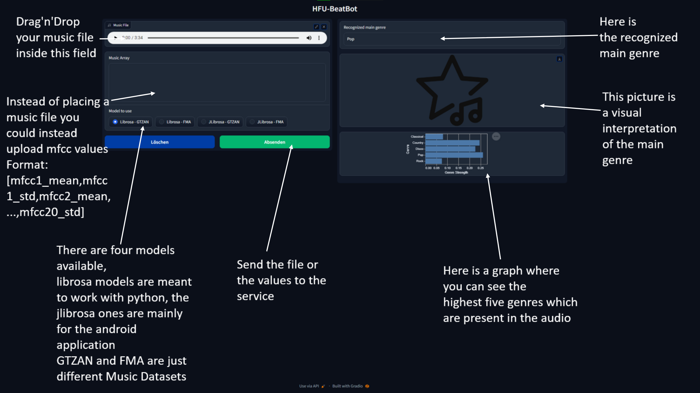

# EasyMLServe

This application is based on the [EasyMLServe](https://github.com/KIT-IAI/EasyMLServe/) Projekt from KIT and we used it as a case study to test the usability of an easy usage of machine learning models in the musical environment.<br>
It consists of a service, which is the core of the app and an user interface (website), that is used for testing and accessing the service.<br>
The service hosts multiple machine learning models on a server, that can be accessed via a REST API.<br>
The goal is that many different applications can access these ml models through the API.

## How to use the service and the website

<details>
<summary>Click here when you are interested in how to use the service.</summary>

The service is reachable on port 8000.

Simply send a JSON Post request to /process:

```
{
    "model_to_use": 2, // 0 = "Librosa - GTZAN", 1 = "Librosa - FMA", 2 = "JLibrosa - GTZAN", 3 = "JLibrosa - FMA"
    "music_array": [
        mfcc_01_mean,mfcc_01_std,...,mfcc_20_mean,mfcc_20_std
    ]
}
```

The service will answer with a response like this:

```
{
  "genre": "Metal",
  "confidences": {
    "Blues": 0.001,
    "Classical": 0.002,
    "Country": 0.005,
    "Disco": 0.018,
    "HipHop": 0.0132,
    "Jazz": 0.0003,
    "Metal": 0.562,
    "Pop": 0.0533,
    "Reggae": 0.025,
    "Rock": 0.3202
  }
}
```

</details>

<details>
<summary>Click here when you are interested in how to use the website.</summary>

The website is reachable on port 8080.



</details>

<details>
<summary>Click here when you are interested in the different models.</summary>

Four models are available, which differ in the following points:

- The language in which the mfcc values are generated:
  - Librosa: The popular Python library for working with audio files.
  - JLibrosa: The Java counterpart to the Python library, used because it generates slightly different values than Librosa.
- The data set from which the mfcc values are generated (we split the sound files described below into 5-second parts and added noise, doubling the number of snippets):
  - GTZAN: 10 genres, 100 audio files, each 30 seconds long.
  - Free Music Archive (FMA): 8 genres, 1000 audio files, each 30 seconds long.

</details>

## Local Development (on Windows PC)

### Install packages

```
pip install -r requirements.txt
pip install -e .
```

Install ffmpeg for working with music files:

- [Install on windows for development. (Don't use the essential bundle, only the full)](https://phoenixnap.com/kb/ffmpeg-windows) or install with choco `choco install ffmpeg-full`
- [Download FFmpeg](https://ffmpeg.org/download.html)

### Run

- Start service

```
python3.9.exe .\genre_detection\service.py
```

- Start user interface

```
python3.9.exe .\genre_detection\ui.py
```

## Setup Ubuntu VM

Version: Ubuntu 22.04.2 LTS (GNU/Linux 5.15.0-72-generic x86_64)

- Clone from Git repository
- Go into repository folder (EasyMLServe)
- Create virtual environment

```
sudo apt install python3-virtualenv
virtualenv --python python3 venv
```

- Activate venv

```
source venv/bin/activate
```

- Install packages

```
pip install -r requirements.txt
```

- Install missing packages on VM (May vary from system to system)

```
sudo apt install libglu1-mesa

sudo apt install libxkbcommon-x11-0

sudo apt install libgl1

sudo apt install libegl1-mesa

sudo apt install ffmpeg
```

### How to run the service and the website

The service and the website are plain python files ([service.py](genre_detection/service.py) & [ui.py](genre_detection/ui.py)) and therefore can simply be started via terminal.<br>
Accessing multiple terminals simultaneously can be achieved with [tmux](https://github.com/tmux/tmux/wiki).

- Install tmux

```
sudo apt install tmux
```

#### First setup

1. Create session `tmux new -s beatbot`
2. Split session `Press ctrl b and %`
3. Navigate in both windows to `EasyMLServe` directory
4. Activate venv in both windows `source venv/bin/activate`
5. Start service in first window `python genre_detection/service.py`
6. Start website in second window `python genre_detection/ui.py`
7. Detach from session `Press ctrl b and d`

#### Further usage

1. Connect to session `tmux attach -t beatbot`
2. Stop service and ui: `ctrl c` in both windows
3. Start them again
4. Detach from session

## Related project

Here's the original project where the code was coming from. We adapted a few things to match our needs.

- [EasyMLServe](https://github.com/KIT-IAI/EasyMLServe/)

## License

This code is licensed under the [MIT License](https://github.com/KIT-IAI/EasyMLServe/blob/main/LICENSE).
